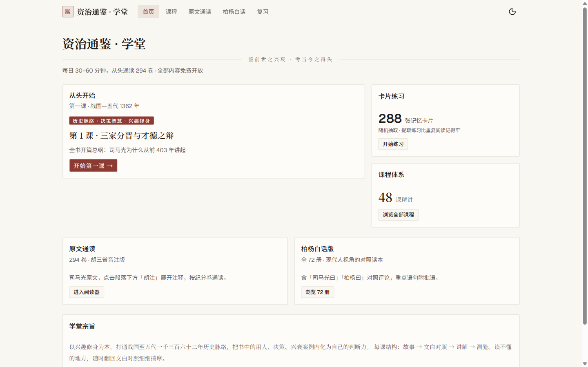
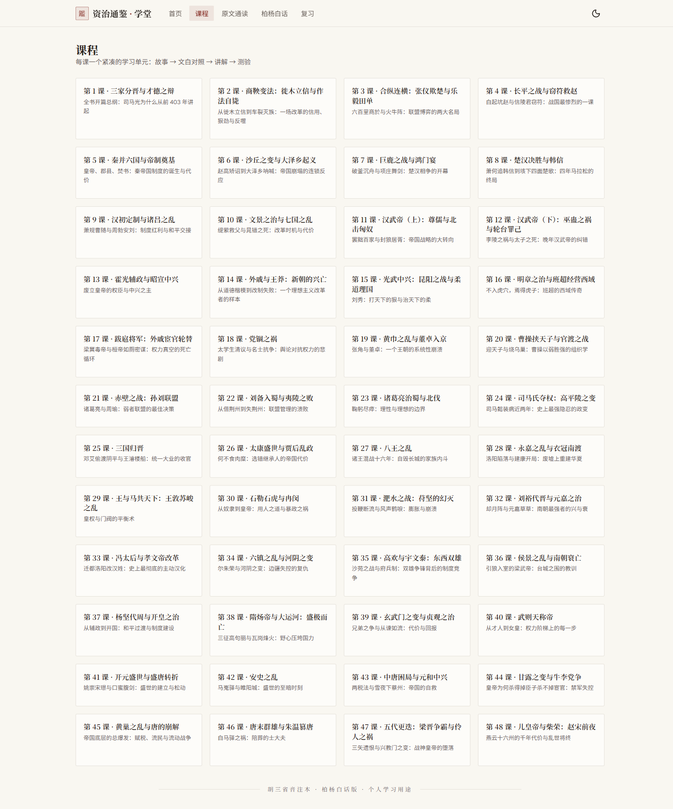
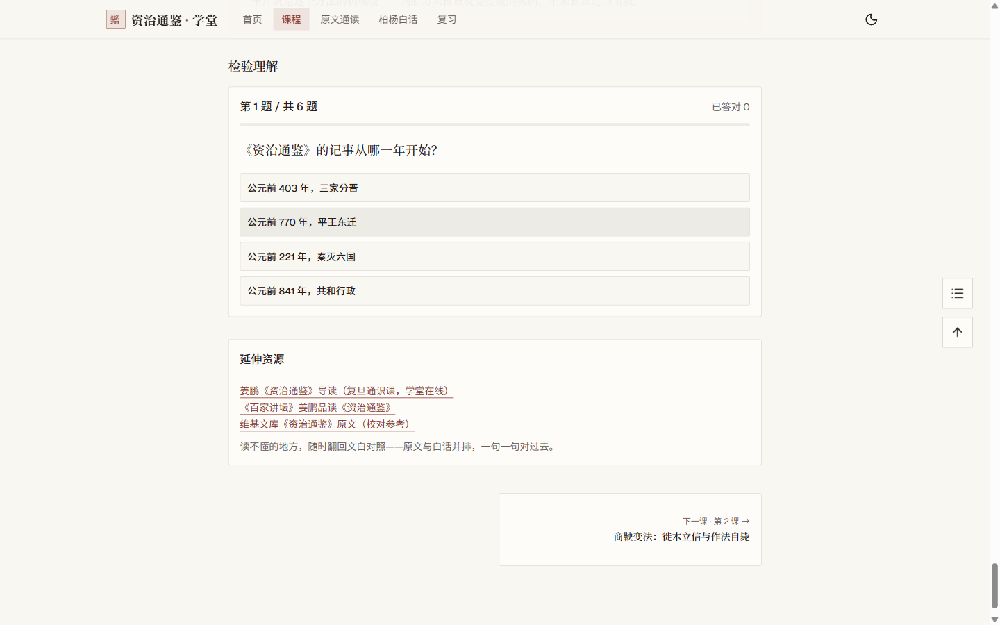
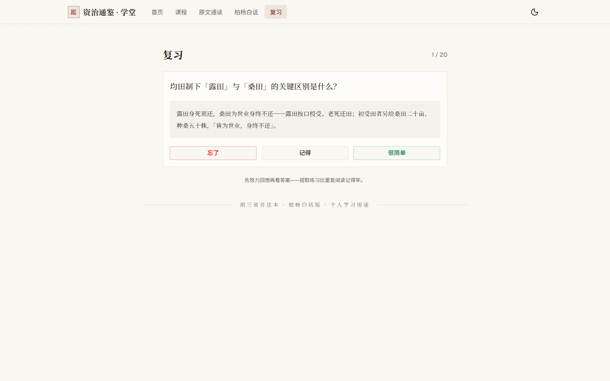
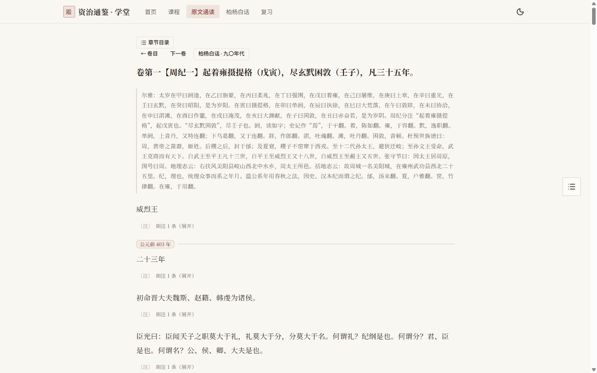

# 资治通鉴 · 学堂

**在线阅读：<https://zztj.yongkong.dev>** —— 无需注册登录，全部内容免费开放。

以**胡三省音注版**《资治通鉴》为原文底本、**柏杨白话版（全 72 册）**为对照译文的公共学习网站：
48 节结构化课程贯穿三家分晋到赵宋前夜 1,362 年，配合文白对照阅读器与卡片提取练习。
纯静态站：`next build` 一次导出 650+ 个预渲染页面，可部署到任意静态托管。

| | |
| --- | --- |
|  |  |
|  |  |
|  |  |
|  |  |

## 功能

- **48 节课程**：每课 = 三点速览 → 故事讲解 → 文白对照选段 → 决策启示（管理/工作/生活/学习四场景）→ 6 题随堂测验（即时判分与解析）
- **文白对照**：原文/柏杨白话/对照三种阅读模式；胡三省〔〕注折叠展开；重点句藤黄高亮，悬停看批语
- **原文通读**：294 卷按纪分组浏览，公元年份锚点分段，胡注逐段折叠，一键跳到对应柏杨白话章节
- **柏杨白话**：72 册 → 年代章节浏览；年份表头、各国纪年对照、司马光曰（朱线引文）、柏杨曰（底色块）分区排版
- **卡片复习**：288 张记忆卡片随机抽 20 张，先回想再看答案的提取练习（忘了/记得/很简单三档自评）
- **纯静态**：无登录、无进度记录、无服务端——打开即学，构建产物扔到任何静态托管即可运行

## 快速开始

```bash
cd app
npm install
npm run dev        # 开发模式 http://localhost:3000
npm run build      # 全站静态导出到 out/（650+ 页）
npm run preview    # 本地起静态服务器预览 out/
```

- 课程与语料以静态 JSON 形式提交在 `app/content/`，构建与运行都不需要数据库
- 重新解析 EPUB 语料（需自备两套电子书）见 [app/README.md](app/README.md)
- 加一课的完整流程见下方「内容管线」

## 课程体系（48 课）

按时代推进，每课围绕一个决策案例与一组可复用的判断框架：

| 时代 | 课程 | 时代 | 课程 |
| --- | --- | --- | --- |
| 战国 | 1–4（三家分晋 · 商鞅变法 · 合纵连横 · 长平之战） | 三国 | 20–25（官渡 · 赤壁 · 入蜀 · 北伐 · 高平陵 · 归晋） |
| 秦 | 5–6（帝制奠基 · 沙丘与大泽乡） | 西晋 | 26–28（贾后 · 八王 · 南渡） |
| 楚汉 | 7–8（巨鹿鸿门 · 楚汉决胜） | 东晋十六国 | 29–31（门阀 · 石勒 · 淝水） |
| 西汉 | 9–14（汉初 · 文景 · 武帝 · 昭宣 · 王莽） | 南北朝 | 32–36（刘裕 · 孝文帝 · 六镇 · 双雄 · 侯景） |
| 东汉 | 15–19（光武 · 班超 · 外戚 · 党锢 · 黄巾） | 隋 | 37–38（开皇 · 大运河） |
| | | 唐 / 五代 | 39–48（贞观 · 武则天 · 开元 · 安史 · 元和 · 甘露 · 黄巢 · 唐末 · 五代 · 柴荣） |

完整清单（slug / 语料定位 / 主题）见 [`app/content-src/curriculum.md`](app/content-src/curriculum.md)。

## 内容管线：加一课 = 加一个目录

课程不是代码，是**数据**。每课一个目录 `app/content-src/lessons/<slug>/`：

```
lesson.json      # 速览 / 讲解块 / 文白对照选段 / 启示 / 测验
highlights.json  # 重点句高亮 + 批语
```

语料引用使用**锚文本寻址**：段落前缀 ≥6 字、卷/册内唯一，导出时解析为段落序号——
ingest 重建导致的序号漂移会在导出/校验时显式报错（fail fast），而不是静默显示错误段落。
写好课程文件后 `npm run content:check` 全绿，再 `npm run content:export && npm run build` 即可上线。

```
EPUB ──ingest.py──▶ data/tongjian.db ──content:export──▶ content/（静态 JSON, 提交进仓库）
content-src/lessons/<slug>/（课程源, 文件事实源）─────────┘        │
                                                        next build 构建期读取
```

## 技术栈

Next.js 16（App Router，`output: 'export'` 全静态导出）+ React 19 + Tailwind CSS 4 + shadcn/ui ｜ Python 标准库解析 EPUB（294 卷 / 32,725 段 + 72 册 / 231 章节 / 55,571 段语料）→ Node 导出静态 JSON ｜ 本站部署于 Cloudflare Pages

架构与目录结构详情见 [app/README.md](app/README.md)。

## 数据来源与版权

两本 EPUB 为自购电子书，解析文本仅限学习用途，不得分发。
